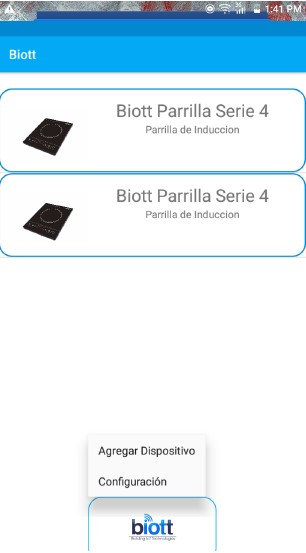
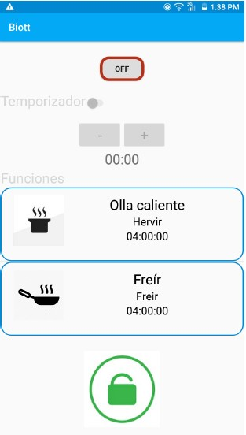

# Aplicacion-Biott 

_Esta aplicación se elaboró como parte de **Proyecto Integrador** (Semestre 2019/2020-I) de la carrera de **Ingeniería en Mecatrónica** de la **Facultad de Ingeniería, UASLP**. La aplicación móvil, la cual se conecta a una tarjeta NodeMCU ESP8266 para operar una parrilla de inducción._

## Comenzando 🚀

La aplicación puede ser instalada en cualquier smartphone que cuente con _SO Android versión 4.1_ o _superior_.

Además, se anexa el código que se ejecuta en la tarjeta [NodeMCU](nodeMCU), que tiene como objetivo el encargarse de los siguientes aspectos:
- Conexión de la parrilla de inducción a una red inalámbrica.
- Comunica la parrilla con el dispositivo móvil para manipulación y control.
- Monitoreo de temperatura del sistema.

### Pre-requisitos 📋

La versión de **Android Studio** que se utilizó para realizar este proyecto fue la `3.5.1`.

## Instalación 🔧

La aplicación es instalada desde el software de **Android Studio**.

De igual forma, es necesario cargar el [código](nodeMCU) en la tarjeta NodeMCU desde el software de **Arduino**.

## Uso de la aplicación 📱

### Configurar una red WiFi

Antes de utilizar el dispositivo es necesario configurar la red a la cual se conectará el dispositivo, para esto, presiona sobre el ícono de ***biott*** que aparece en la parte inferior de la ventana principal de la aplicación. Aparecerá un menú, selecciona la opción ***Configuración*** y después ***Actualizar información WiFi***.

Verifica que tu dispositivo móvil esté conectado a la red WiFi que deseas configurar, pulsa el botón ***Agregar red WiFi*** e ingresa la contraseña.

### Vincular un dispositivo con la aplicación móvil

Para vincular un dispositivo, presiona sobre el ícono de ***biott*** y selecciona la opción de ***Agregar dispositivo*** en el menú desplegable. Aparecerá una lista de dispositivos configurables, selecciona el dispositivo que deseas configurar e ingresa _Parrilla_ como contraseña, en caso de ocurrir un error, se mostrará una ventana emergente, pulsa la opción de ***Reintentar***. Si la configuración se realizó con éxito, regresará a la venta principal, en donde se visualizará el dispositivo recién configurado, en caso de no aparecer el dispositivo, cierra y vuelve a abrir la aplicación.

### Control del dispositivo con la aplicación

En la ventana principal selecciona el dispositivo que deseas utilizar. Presiona el botón ***OFF*** para encender el dispositivo y poder comenzar a utilizarlo.

### Funciones personalizadas

Utilizando los botones ***+*** y ***-*** se puede configurar el tiempo que durará la parrilla calentando, y mediante el botón de ***LOCK/UNLOCK*** podrá bloquear la parrilla para evitar que la configuración previamente hecha cambie mientrás se está utilizando el dispositivo.

### Funciones automáticas

La aplicación cuenta con una serie de funciones predeterminadas, al presionar cualquiera de estas funciones, el dispositivo comenzará a funcionar durante el tiempo indicado. *Se recomienda bloquear el dispositivo para evitar cambios en la configuración mientras el dispositivo está en funcionamiento.*

